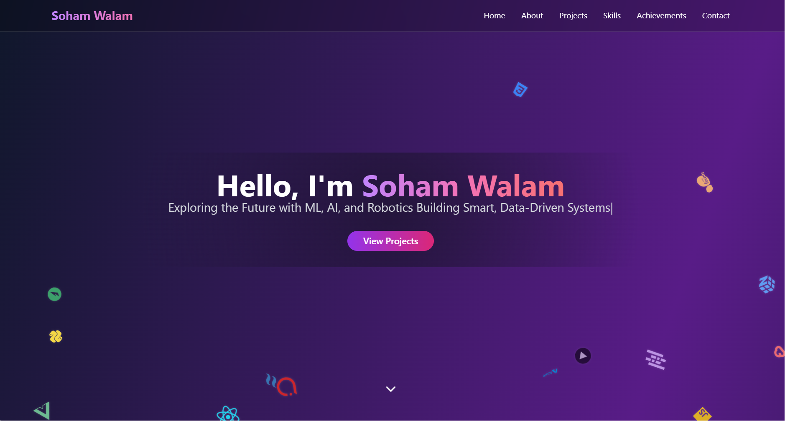

# 💼 Developer Portfolio Website

Welcome to my personal portfolio website — a modern, responsive, and interactive platform built to showcase my skills, projects, achievements, and professional journey.

 <!-- Replace with your actual screenshot path -->

---

## 🚀 Tech Stack

## 📂 Features

- ✨ **Hero Section** with animated typing effect & floating tech icons  
- 🗃️ **Projects Showcase** with modal previews and source links  
- 📑 **Skills** categorized using ShadCN Tabs  
- 💼 **Internships & Work Experience** cards  
- 📜 **Certifications and Achievements**  
- 📬 **Contact Form** with social media links  
- 🎯 Fully responsive and mobile-friendly design  

 ## Use:
 
| Technology        | Description                     |
|-------------------|---------------------------------|
|  | Utility-first styling |
|  | Beautiful component library |
|  | Smooth animations |
|  | Deployment platform |

---

## 📂 Features

- ✨ **Hero Section** with animated typing effect & floating tech icons  
- 🗃️ **Projects Showcase** with modal previews and source links  
- 📑 **Skills** categorized using ShadCN Tabs  
- 💼 **Internships & Work Experience** cards  
- 📜 **Certifications and Achievements**  
- 📬 **Contact Form** with social media links  
- 🎯 Fully responsive and mobile-friendly design  
